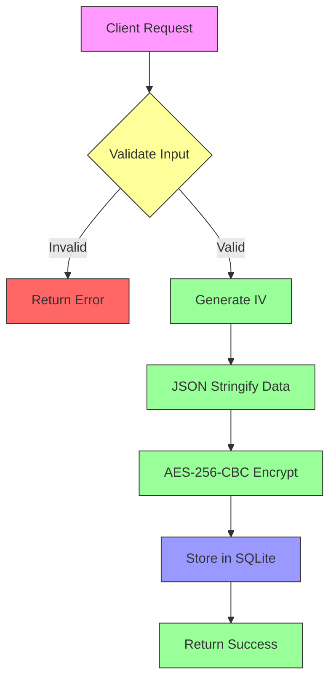
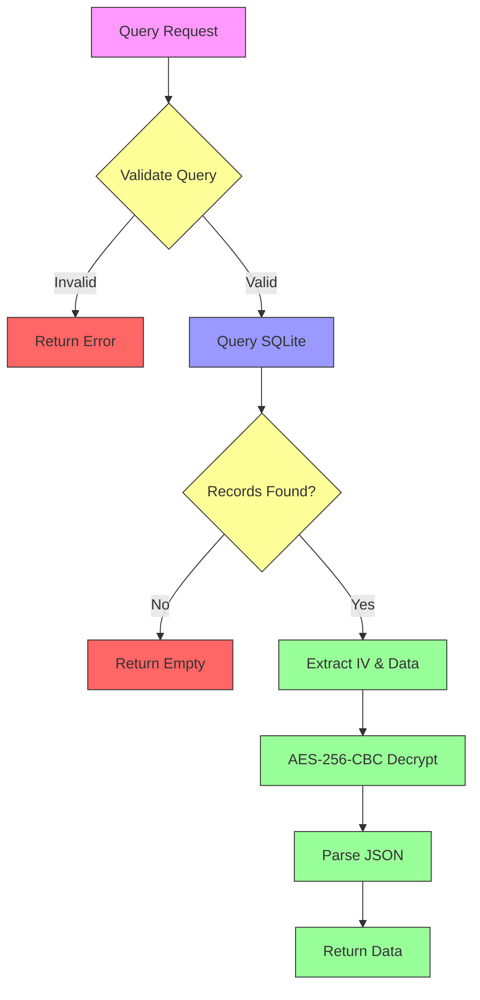
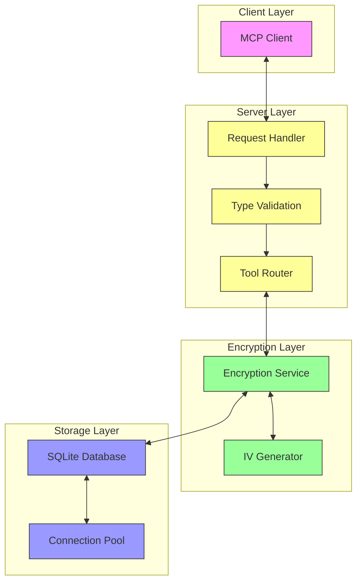

# Data Flow and Encryption Process

## Personal Information Storage Flow



## Data Retrieval Process



## System Architecture



## Database Schema

```mermaid
erDiagram
    PERSONAL_INFO {
        string id PK
        string type
        string name
        string relationship
        string encrypted_data
        string created_at
        string updated_at
    }

    PERSONAL_INFO ||--o{ INDEXES : has
    INDEXES {
        string idx_personal_info_type
        string idx_personal_info_name
    }
