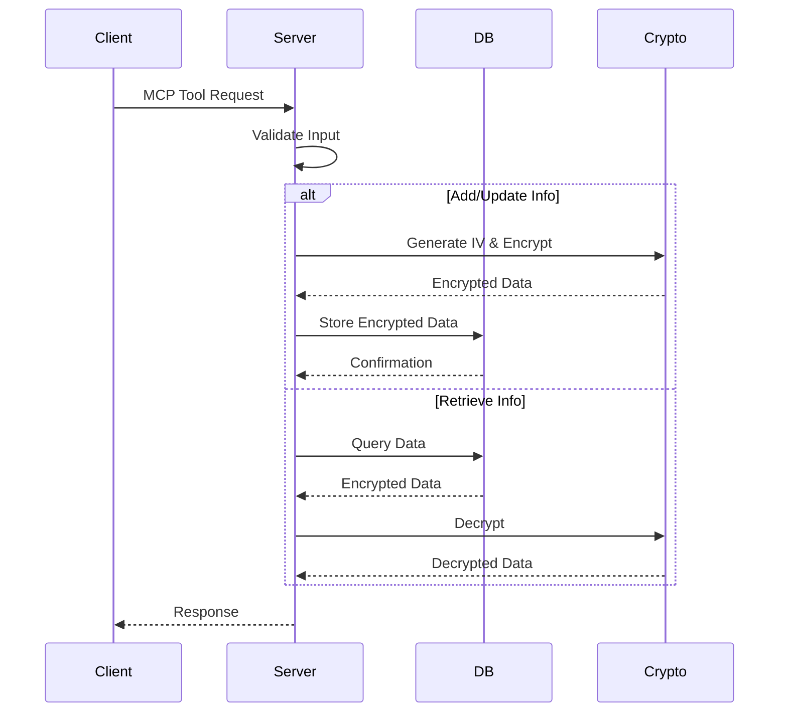

# Personal Context MCP Server

This is a Model Context Protocol (MCP) server that provides secure storage and management of personal information and context. The server implements robust encryption and provides tools for storing, retrieving, and searching personal data.

## Core Concepts

### Personal Information Types

The server handles three types of personal information:
- **Contacts**: Information about people (name, phone, email, etc.)
- **Preferences**: User preferences and settings
- **Context**: General contextual information about the user

### Security Model

All personal data is encrypted using AES-256-CBC encryption:
- Each piece of data uses a unique Initialization Vector (IV)
- Data is encrypted before storage and decrypted upon retrieval
- The encryption key is provided via environment variable or generated at startup
- The database only stores encrypted data

## Architecture

### Components

1. **Database Layer** (`src/db.ts`)
   - Manages SQLite database operations
   - Handles encryption/decryption of data
   - Provides CRUD operations for personal information

2. **Type System** (`src/types.ts`)
   - Defines core data structures and interfaces
   - Implements error handling types
   - Ensures type safety across the application

3. **MCP Server** (`src/server.ts`)
   - Implements the MCP protocol interface
   - Provides tools for personal information management
   - Handles request validation and error responses

### Data Flow

## Available Tools

1. `add-personal-info`
   - Adds new personal information
   - Requires type, name, and data
   - Optionally accepts relationship

2. `update-personal-info`
   - Updates existing information by ID
   - Merges new data with existing data

3. `get-personal-info`
   - Retrieves information by ID/name/type/relationship
   - Returns decrypted data

4. `search-personal-info`
   - Searches across name and relationship fields
   - Returns all matching decrypted records

## Configuration

The server accepts two environment variables:
- `ENCRYPTION_KEY`: Custom encryption key (generated if not provided)
- `DB_PATH`: Custom SQLite database path (defaults to ./personal_context.db)

## Security Considerations

1. The encryption key should be kept secure and not committed to version control
2. The database file contains encrypted data but should still be protected
3. All sensitive data is encrypted using AES encryption
4. Failed decryption attempts are logged and handled securely

## Development Guidelines

1. Always validate input data using type guards
2. Ensure proper error handling and logging
3. Maintain encryption throughout the data lifecycle
4. Use prepared statements for database queries
5. Keep the database connection properly managed

## Testing

When implementing new features or making changes:
1. Test encryption/decryption with various data types
2. Verify proper error handling
3. Ensure data integrity across operations
4. Test search functionality with different queries
5. Verify proper cleanup on server shutdown
